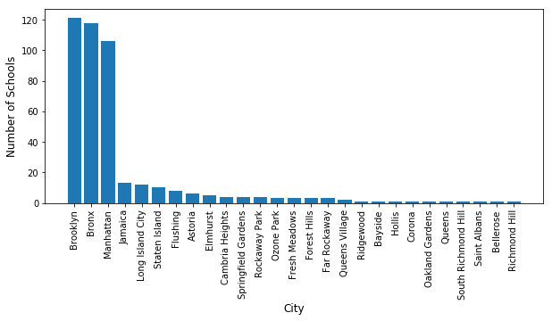
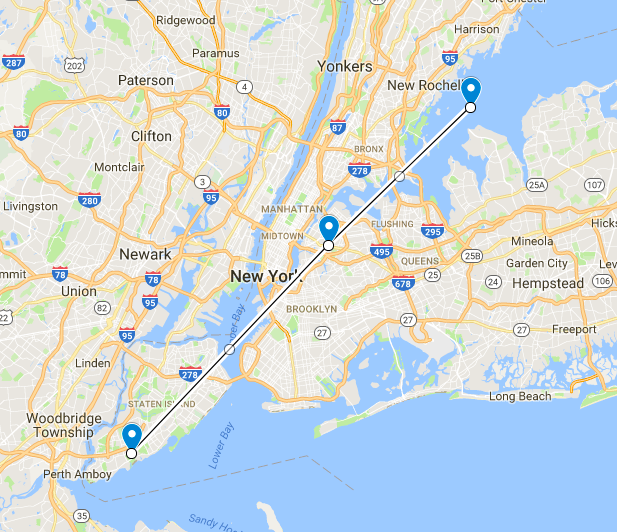

# SAT-Scores
[This project](https://github.com/danieldiamond/SAT-Scores/blob/master/SAT_Scores.ipynb) serves as an example of exploratory data analysis on NY School SAT Scores. EDA is essential to any predictive modeling approaches as it enhances your domain knowledge and ultimately provides a deeper understanding of model predictions.

The general sequence will involve:
- Problem Definition
- Data acquisition
- Analysis of data
- Data Wrangling
- Modeling and Predicting
- Present Solution.

EDA is not rigid process and requires combinations of various stages. For example, we will perform a preliminary analysis of the data and concurrently correct or complete various features as necessary to ease the analysis procedure. Furthermore, we may wish to perform further anaylsis once we have a complete dataset after the data wrangling stage.

The dataset was obtained from [NYC Open Data](https://data.cityofnewyork.us/Education/2012-SAT-Results/f9bf-2cp4).

